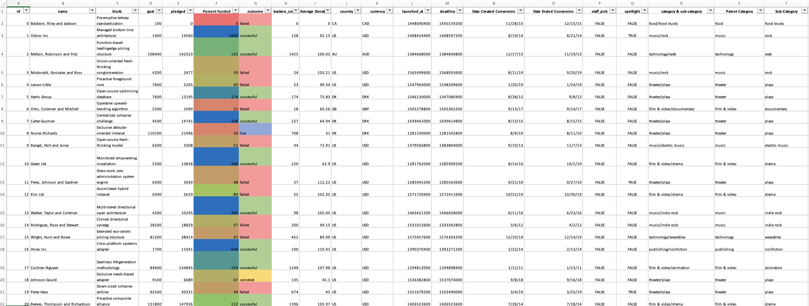
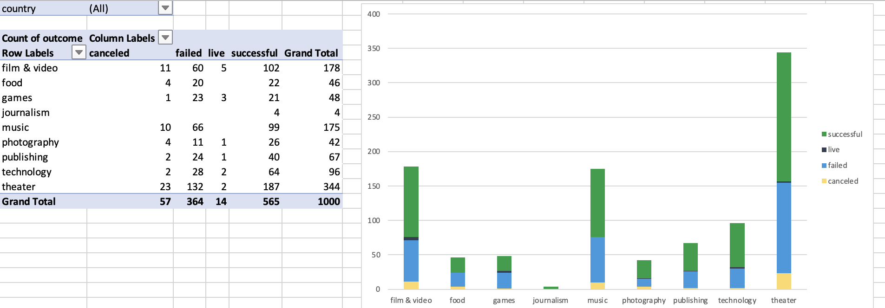
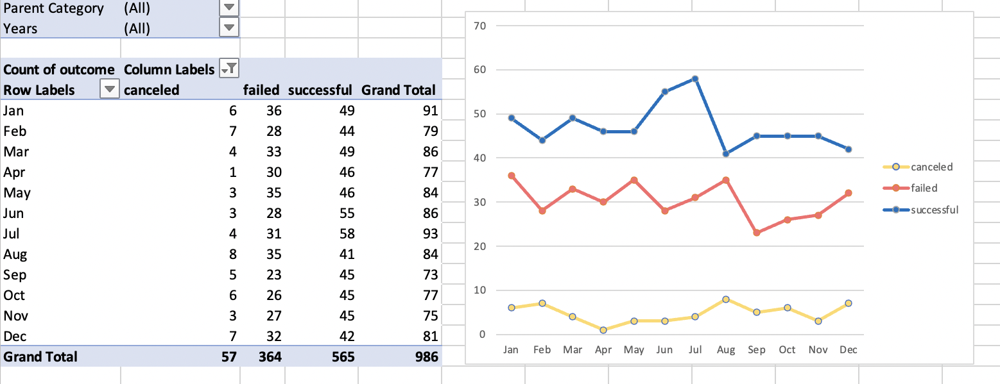
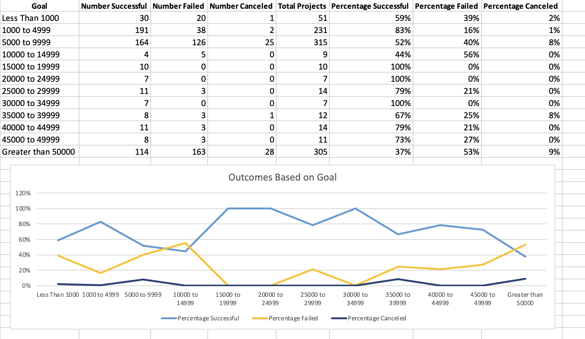
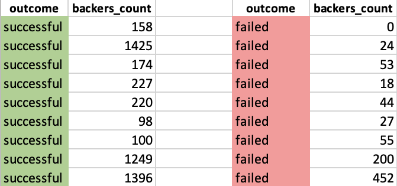
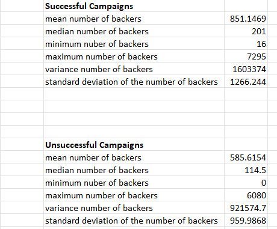

# Crowdfunding Campaign Analysis and Insights 

## Background

Crowdfunding platforms like Kickstarter and Indiegogo have been growing in success and popularity since the late 2000s. From independent content creators to famous celebrities, more and more people are using crowdfunding to launch new products and generate buzz, but not every project has found success.

To receive funding, the project must meet or exceed an initial goal, so many organizations dedicate considerable resources to looking through old projects in an attempt to discover “the trick” to finding success. For this week's Challenge, you will organize and analyze a database of 1,000 sample projects to uncover any hidden trends.

### Instructions

- Here, I will use conditional formatting to fill each cell in the **outcome** column with a different color, depending on whether the associated campaign was successful, failed, canceled, or is currently live.
   - Create a new column called **Percent Funded** that uses a formula to find how much money a campaign made relative to its initial funding goal.

- Use conditional formatting to fill each cell in the **Percent Funded** column according to a three-color scale. The scale should start at 0 with a dark shade of red, and it should transition to green at 100 and blue at 200.
   - Create a new column called **Average Donation** that uses a formula to find how much each project backer paid on average.
   - Create two new columns, one called **Parent Category** and another called **Sub-Category**, that use formulas to split the **Category and Sub-Category** columns into two new, separate columns.

- Create a new sheet with a pivot table that analyzes your initial worksheet to count how many campaigns were successful, failed, canceled, or are currently live per **category**.

- Create a stacked-column pivot chart that can be filtered by country based on the table that I created.

**Analysis:** The chart shows that in crowdfunding, theater projects have the most and the highest success rate, with technology also doing well. Music and film have many campaigns, but music is more successful. Journalism hardly succeeds and might be less suited for crowdfunding. Games are hit or miss. Food, photography, and publishing often fail, suggesting higher risk in these areas. Few campaigns are live or canceled, meaning most either succeed or fail outright. Theater and technology are the best bets for crowdfunding success, while journalism and games are tougher sells.

- Create a new sheet with a pivot table that analyzes my initial sheet to count how many campaigns were successful, failed, or canceled, or are currently live per **sub-category**. 
- Create a stacked-column pivot chart that can be filtered by country and parent category based on the table that I created.
- The dates in the **deadline** and **launched_at** columns use Unix timestamps.
   - Create a new column named **Date Created Conversion** that will be used o convert the data contained in **launched_at** into Excel's date format.
   - Create a new column named **Date Ended Conversion** that will be used to convert the data contained in **deadline** into Excel's date format.
   

**Analysis:** The graph analysis shows that plays dominate in both the number of crowdfunding campaigns and success rate, followed by rock music. Documentaries perform moderately well, while video games show an even split between successes and failures. The web category has many campaigns but a higher failure rate. Sub-categories like animation and indie rock do well, whereas audio, metal, and world music have fewer campaigns, suggesting they are niche markets. Entertainment-related categories, especially theater and music, are more successful in crowdfunding.

 - Create a new sheet with a pivot table with a column of **outcome**, rows of **Date Created Conversion**, values based on the count of **outcome**, and filters based on **parent category** and **Years**.
   - Now, I will create a pivot-chart line graph that visualizes this new table.
     

**Analysis:** The provided graph illustrates the outcomes of crowdfunding campaigns by month. The key observations are:

Successful Campaigns: There are two peaks, one in June with 55 successful campaigns and another in July with 58. These months are the most favorable for campaigns to succeed.

Failed Campaigns: The number of failed campaigns generally hovers around 30 per month, with a noticeable increase in March to 33 and a peak in December at 36.

Canceled Campaigns: Cancellations are relatively low and consistent throughout the year, with a slight increase in August to 8.

Overall, the data suggests that the middle of the year, particularly June and July, maybe the best time to launch crowdfunding campaigns for a higher chance of success. The end of the year, especially December, has the highest risk of failure. Cancellations do not show a clear pattern throughout the year. 

### **The observed trends in my analysis of crowdfunding campaigns could be due to several factors:**

- **Popularity and Community Support:** Theater and Technology are often driven by strong community support and interest. Theater projects, in particular, may benefit from a dedicated community that is passionate about supporting the arts. Technology projects often attract backers interested in innovation and new gadgets.

- **Project Visibility and Marketing:** Success in these categories might also be influenced by how well the projects are marketed and the visibility they receive. Theater and technology projects may be more likely to have robust marketing campaigns that effectively reach potential backers.

- **Discretionary Spending and Trends:** The middle of the year may coincide with times when people have more disposable income (such as after-tax refunds in some countries) or when they are more engaged with online platforms, leading to a higher chance of success for campaigns launched in June and July.

- **Seasonal Factors:** December's higher risk of failure could be due to the holiday season when potential backers might prioritize personal spending over crowdfunding contributions.

- **Goal Feasibility:** Lower financial goals are generally perceived as more achievable, making it easier for backers to believe that their contributions can make a difference. This can lead to higher success rates for campaigns with modest goals.

- **Risk Assessment by Backers:** For higher goal amounts, backers may be more cautious, as these projects are seen as more ambitious and riskier. The probability of large projects not delivering on their promises or facing logistical challenges may deter backers.

- **Economic Factors** Broader economic conditions can also influence crowdfunding success. For example, during economic downturns, backers may be more conservative with their spending, affecting the success of campaigns.

- **Niche Appeal:** Journalism and games may face challenges due to their niche appeal or the saturation of the market with many similar projects, making it harder for individual campaigns to stand out.

  
### Then I will create a report in Microsoft Word, and answer the following questions:

**Question: Given the provided data, what are three conclusions that we can draw about crowdfunding campaigns?**
     
**Ans:** From the provided data on crowdfunding campaigns, here are three conclusions that can be drawn:

1.	Crowdfunding campaigns can be risky. Only 565 of the 986 campaigns were successful, with 421 failing or being canceled. This means that people who want to start a crowdfunding campaign must carefully plan and execute it in order to increase their chances of success. So, based on the data, it is possible to conclude that starting a crowdfunding campaign is a risky venture that requires careful planning and execution to increase the chances of success.

2.	Based on the data, it has been observed that the film & video, and theater(plays) categories have the most campaigns. The theatre category performed exceptionally well with 187 successful campaigns, surpassing the film & video category, which had 102 campaigns. When considering all categories, theatre and film & video had the highest number of campaigns with 344 and 178, respectively. This indicates that these categories are popular among those looking to launch crowdfunding campaigns.

3.	It has been observed in the data that crowdfunding campaigns tend to have a greater chance of success in the middle of the year, particularly in June and July. So, it can be concluded that, during the summer season, there is a strong possibility that there will be a significant increase in participation in crowdfunding campaigns.

**Question: What are some limitations of this dataset?**

**Ans:** There are some limitations to crowdfunding data that should be taken into consideration, including:

1.	The sample size of the crowdfunding dataset may not provide a comprehensive representation of the entire crowdfunding market, thus limiting the accuracy of the information gathered.  Drawing overall conclusions about the crowdfunding process can be challenging due to this.
	
2.	The data provided is limited in scope as it only covers certain categories and subcategories within specific crowdfunding platforms. This means that the data may not accurately represent the broader crowdfunding market and may not be comparable to other platforms or markets. This can make it difficult to draw comprehensive conclusions about how crowdfunding works. Additionally, the dataset only includes information from campaigns that have chosen to use these specific categories and subcategories, which may create self-selection bias.
	
3.	The "backers_count" in the crowdfunding data only shows how many people supported a campaign, but it doesn't give any information about who they are or why they supported it. This data is limited because it doesn't provide details about the individual backers, like their demographics or motivations. This information can be important for creating successful crowdfunding campaigns, but the current dataset doesn't have it.
	
4.	Another limitation is the dataset's coverage is restricted to campaigns in specific countries and regions, which may not accurately represent the global crowdfunding market. As a result, concluding crowdfunding on a global scale could be challenging due to the limited generalizability of the data.
	
5.	The current data available on crowdfunding campaigns may not provide a complete understanding of the process as it lacks adequate information on unsuccessful campaigns. Understanding why both successful and unsuccessful campaigns happen is important, but this data isn't in the dataset.
 

**Question: What are some other possible tables and/or graphs that we could create, and what additional value would they provide?**

**Ans:**  **Bar Graph:** Analyzing the success rate of crowdfunding campaigns by country/region through a bar graph can provide key insights into different markets. With this information, potential opportunities and challenges can be identified with confidence in various regions.

**Box Plot:** The distribution of funding amounts for successful campaigns within each category and subcategory could be displayed using a box plot. This would make it easier to identify any trends or outliers within each category. 

**Scatter Plot:** This could show the relationship between the funding goal and the amount of money raised. This would help identify any trends or patterns in how campaigns are funded.

**Pie chart:** A pie chart might display the percentage of campaigns that succeeded in raising the desired amount of money as opposed to those that failed. This would give a summary of the dataset's overall success rates.

### Crowdfunding Goal Analysis
- Now, I will create a new sheet with 8 columns:
   - Goal
   - Number Successful
   - Number Failed
   - Number Canceled
   - Total Projects
   - Percentage Successful
   - Percentage Failed
   - Percentage Canceled

- In the Goal column, I will create 12 rows with the following headers:
   - Less than 1000
   - 1000 to 4999
   - 5000 to 9999
   - 10000 to 14999
   - 15000 to 19999
   - 20000 to 24999
   - 25000 to 29999
   - 30000 to 34999
   - 35000 to 39999
   - 40000 to 44999
   - 45000 to 49999
   - Greater than or equal to 50000
     
- Using the **COUNTIFS()** formula, count how many successful, failed, and canceled projects were created with goals within the ranges listed above. Then, populate the **Number Successful**, **Number Failed**, and **Number Canceled** columns with these data points.
- After that, I will add up each of the values in the **Number Successful**, **Number Failed**, and **Number Canceled** columns to populate the **Total Projects** column. Then, using a mathematical formula, find the percentage of projects that were successful, failed, or canceled per goal range.
- Create a line chart that graphs the relationship between a goal amount and its chances of success, failure, or cancellation.
  

**Analysis:** The data shows that crowdfunding campaigns with lower goals (up to $4,999) are more likely to succeed, with the best success rate at 83%. Campaigns with goals between $15,000 and $34,999 also did well but are less common. However, as the goals get bigger, especially over $50,000, the success rate drops significantly to 37%. Cancellations are rare, especially for campaigns with goals over $10,000, except for a small increase for goals between $5,000 and $9,999. The most failures happen with the largest goals, over $50,000.

In summary, crowdfunding campaigns with lower financial goals tend to have higher success rates, while those with goals exceeding $50,000 face more challenges, reflected in a higher failure rate. Very few projects are canceled once they're set up, especially in the mid to higher ranges of funding goals.

### Statistical Analysis
Most people would use the number of campaign backers to assess the success of a crowdfunding campaign. Creating a summary statistics table is one of the most efficient ways that data scientists can characterize quantitative metrics, such as the number of campaign backers.

To gain an in-depth understanding of campaign backers, evaluate the number of backers of successful and unsuccessful campaigns by creating my own summary statistics table.

- Create a new worksheet in my workbook, and create one column for the number of backers of successful campaigns and one column for unsuccessful campaigns.

- I will use Excel to evaluate the following values for successful campaigns, and then do the same for unsuccessful campaigns:
   - The mean number of backers
   - The median number of backers
   - The minimum number of backers
   - The maximum number of backers
   - The variance in the number of backers
   - The standard deviation of the number of backers

**Analysis:** In crowdfunding campaigns, successful ones on average have more backers but also show greater variability in backer numbers than unsuccessful ones. Successful campaigns have a median of 795 backers, while unsuccessful ones have a much lower median of 114.5, indicating that the typical successful campaign has more support.

Unsuccessful campaigns include an outlier with a very large number of backers, which skews the average and variance. The median is a more reliable indicator than the average for both successful and unsuccessful campaigns, as it's less influenced by extreme cases. This could imply that even campaigns with many backers can fail, perhaps due to reasons other than lack of support.

- I will use my data to determine whether the mean or the median better summarizes the data.
  
    - It can be observed from the statistical analysis that the mean number of backers is larger than the median number of backers in both successful and unsuccessful campaigns by comparing the mean and median figures. This shows that the distributions are positively skewed with most campaigns having fewer backers and a limited number of large-backer initiatives.
In such cases, where the distribution is positively skewed, the median is often a better measure of central tendency than the mean because it is less affected by extreme values. 
Therefore, it can be concluded that the median better summarizes the data for both successful and unsuccessful campaigns.

- Also, I will use my data to determine if there is more variability with successful or unsuccessful campaigns. Does this make sense? Why or why not?
  
    - Based on these values of variance and standard deviation, there is more variability in the number of backers for successful campaigns compared to unsuccessful campaigns. The variance and standard deviation values for successful campaigns are higher than those for unsuccessful campaigns.
This result makes sense because successful campaigns tend to have a wider range of backers, with some campaigns receiving a very large number of backers while others receive fewer. On the other hand, unsuccessful campaigns generally have a lower number of backers overall, and their backers tend to have similar numbers. This narrower range of backers for unsuccessful campaigns results in lower variability in the data.
Therefore, based on the statistical analysis, it makes sense that there is more variability in the number of backers for successful campaigns because they have a wider range of outcomes, from highly successful campaigns with many backers to those that are only marginally successful.

**References**

Data for this dataset was generated by edX Boot Camps LLC.
